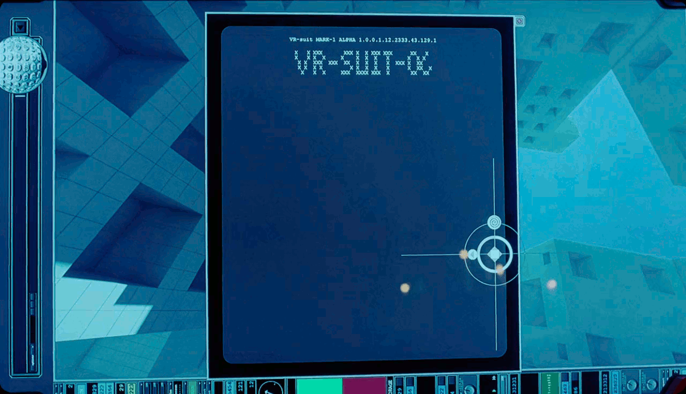
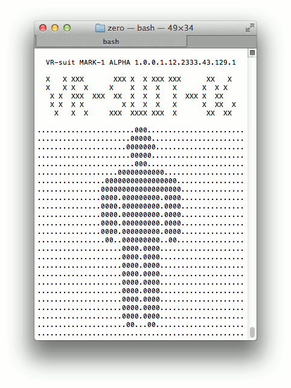

# zero

Loading screen for Qohen's VR-suit from Terry Gilliam's The Zero Theorem

## Installation

```bash
make && sudo make install
```

## Usage

```bash
zero
```

Try putting it into your .bashrc (or .bash_profile) to make it load every time you open a terminal window.

## Demonstration

Film loading screen:



`zero` loading screen:



## Explanation

This section provides no explanation. Rather, if anyone can explain this movie to me, I'd be extremely grateful. Obviously the only thing I understood was an ASCII loading screen from a few seconds of the film.

## Disclaimer

All credit for imagery and artwork taken from the film goes to production companies MediaPro Studios, Voltage Pictures, The Zanuck Company, and Zanuck Independent.
